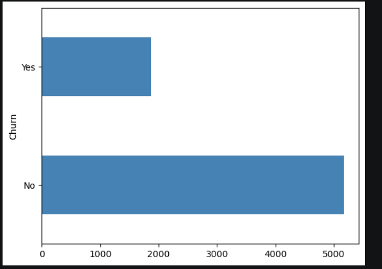

# customer-churn-prediction-ltv-engine
# 🚀 Customer Churn Prediction & Lifetime Value (LTV) Engine

<p align="center">


</p>

---

# 📌 Project Overview

Customer churn is one of the biggest challenges faced by subscription-based businesses such as telecom companies. Predicting customer churn helps organizations identify customers who are likely to leave and take proactive measures to improve customer retention.

This project develops an **end-to-end Customer Churn Prediction & Lifetime Value (LTV) Engine** using Machine Learning and Business Intelligence techniques. In addition to predicting churn, the project estimates customer lifetime value and provides actionable business insights through an interactive Power BI dashboard.

---

# 🎯 Objectives

- Predict customers who are likely to churn.
- Calculate Customer Lifetime Value (LTV).
- Segment customers into Low, Medium, and High value groups.
- Analyze customer behavior using Exploratory Data Analysis (EDA).
- Build interactive Power BI dashboards for business insights.

---

# 📂 Dataset Information

**Dataset:** Telco Customer Churn Dataset

**Total Records:** 7043 Customers

**Target Variable:** Churn (Yes / No)

**Dataset Features Include:**

- Gender
- Senior Citizen
- Partner
- Dependents
- Tenure
- Phone Service
- Internet Service
- Online Security
- Online Backup
- Contract Type
- Payment Method
- Monthly Charges
- Total Charges
- Churn

---

# 🛠️ Tech Stack

| Category | Technologies |
|-----------|--------------|
| Programming Language | Python |
| Data Analysis | Pandas, NumPy |
| Visualization | Matplotlib, Seaborn |
| Machine Learning | Scikit-Learn |
| Data Balancing | SMOTE |
| Dashboard | Power BI |
| Development Environment | Jupyter Notebook |

---

# 📊 Project Workflow

```text
Data Collection
      │
      ▼
Data Cleaning
      │
      ▼
Exploratory Data Analysis (EDA)
      │
      ▼
Feature Engineering
      │
      ▼
One-Hot Encoding
      │
      ▼
Feature Scaling
      │
      ▼
SMOTE (Class Balancing)
      │
      ▼
Machine Learning Models
      │
      ▼
Model Evaluation
      │
      ▼
Customer Lifetime Value (LTV)
      │
      ▼
LTV Segmentation
      │
      ▼
Power BI Dashboard
```

---

# 📈 Exploratory Data Analysis (EDA)

The following analyses were performed:

- Churn Distribution
- Contract Type Analysis
- Monthly Charges Distribution
- Tenure Analysis
- KDE Plots
- Correlation Heatmap
- Customer Retention Analysis

---

# ⚙️ Data Preprocessing

✔ Removed unnecessary columns

✔ Handled missing values

✔ Converted TotalCharges into numerical format

✔ Encoded categorical variables using One-Hot Encoding

✔ Scaled numerical features using MinMaxScaler

✔ Balanced dataset using SMOTE

---

# 🤖 Machine Learning Models

The following classification models were trained and evaluated:

| Model | Accuracy |
|--------|----------|
| Logistic Regression | **82.26%** ✅ |
| Random Forest | **78.07%** |
| Support Vector Machine (SVM) | **76.30%** |

🏆 **Best Performing Model:** Logistic Regression

---

# 📋 Model Evaluation Metrics

The models were evaluated using:

- Accuracy Score
- Precision
- Recall
- F1-Score
- Confusion Matrix
- Classification Report

---

# 💰 Customer Lifetime Value (LTV)

Customer Lifetime Value was calculated using:

```python
LTV = MonthlyCharges × Tenure
```

Customers were segmented into:

- 🟢 High Value Customers
- 🟡 Medium Value Customers
- 🔴 Low Value Customers

This helps businesses identify valuable customers and prioritize retention strategies.

---

# 📊 Power BI Dashboard

The interactive dashboard includes:

- Total Customers
- Churn Rate
- Churned Customers
- Customer Retention
- Churn by Contract Type
- Monthly Charges Analysis
- Churn by Tenure
- Online Security Analysis
- Customer Lifetime Value Insights

---

# 🖥️ Dashboard Preview

## Customer Churn Dashboard

> Replace the image below after uploading.

```markdown

```

---

# 📷 Exploratory Data Analysis

### Churn Distribution

```markdown

```

---

### Contract Analysis

```markdown

```

---

### Customer Lifetime Value Analysis

```markdown

```

---

### Model Evaluation

```markdown

```

---

# 💡 Key Business Insights

- Customers with Month-to-Month contracts exhibit the highest churn rate.
- Customers with longer tenure are significantly less likely to churn.
- Higher monthly charges are associated with increased churn probability.
- High-value customers contribute significantly to overall revenue.
- Contract type and tenure are among the strongest indicators of customer churn.

---

# 📁 Project Structure

```text
Customer-Churn-Prediction-LTV-Engine
│
├── data
│   └── WA_Fn-UseC_-Telco-Customer-Churn.csv
│
├── notebooks
│   └── Customer Churn Prediction & LTV.ipynb
│
├── dashboard
│   └── Customer_Churn_Dashboard.pbix
│
├── images
│   ├── dashboard.png
│   ├── churn_distribution.png
│   ├── churn_contract.png
│   ├── ltv_analysis.png
│   └── confusion_matrix.png
│
├── model
│   └── logistic_regression_model.pkl
│
├── README.md
├── requirements.txt
└── .gitignore
```

---

# 🚀 Future Enhancements

- Deploy model using FastAPI
- PostgreSQL database integration
- Docker containerization
- Real-time churn prediction API
- Cloud deployment (Azure / AWS)

---

# 📚 Skills Demonstrated

- Data Cleaning
- Exploratory Data Analysis
- Feature Engineering
- Machine Learning
- Customer Segmentation
- Data Visualization
- Power BI Dashboard Development
- Business Analytics
- Predictive Modeling

---

# 👨‍💻 Author

## Kuldeep Upadhyay

📧 Email: 

💻 GitHub: https://github.com/kuldeep180304


